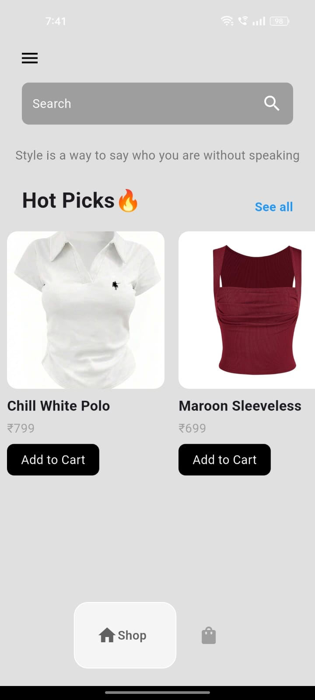
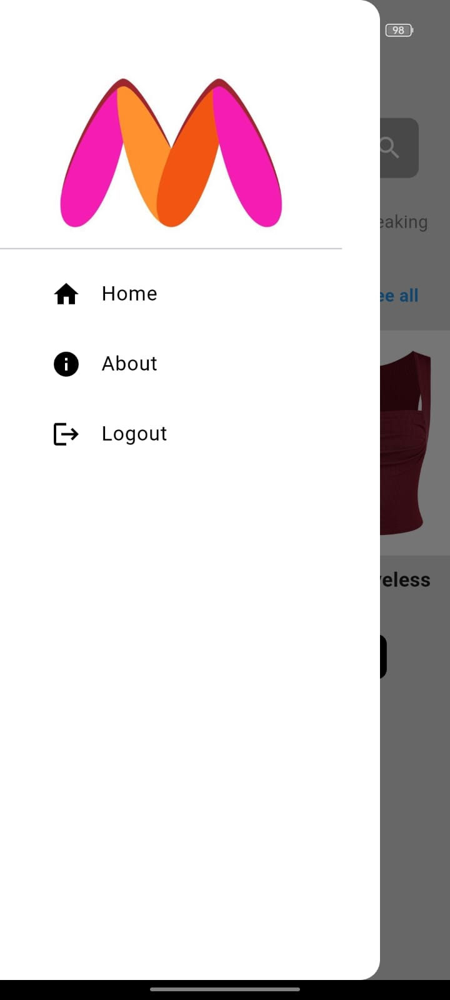

# 🛍️ Myntra Clone - Flutter App

A simple **Myntra-inspired shopping app** built with **Flutter**, featuring a clean UI, product listing, cart management, and navigation drawer.

## 📸 Screenshots

| Home Page                            | Navigation Drawer                        | Cart Page                            |
| ------------------------------------ | ---------------------------------------- | ------------------------------------ |
|  |  |  |

## 🚀 Features

* 🔍 **Search Bar** to find products
* 🏷 **Hot Picks Section** to display featured products
* 🛒 **Add to Cart** functionality
* 🗑 **Remove Items from Cart**
* 📂 **Navigation Drawer** with Home, About, and Logout
* 📱 **Responsive UI** for different screen sizes

## 📂 Project Structure

```
lib/
│── components/
│   ├── bottom_nav_bar.dart
│   ├── clothes_tile.dart
│
│── models/
│   ├── clothes.dart
│
│── pages/
│   ├── main.dart
│   ├── intro_page.dart
│   ├── home_page.dart
│   ├── shop_page.dart
│   ├── cart_page.dart
│
assets/
│── images/
```

## 🛠️ Technologies Used

* **Flutter** (Dart)
* **Material Design**
* **State Management** (setState)

## 📦 Installation

1. **Clone the repository**

   ```bash
   git clone https://github.com/your-username/myntra-clone.git
   ```
2. **Navigate to the project folder**

   ```bash
   cd myntra-clone
   ```
3. **Install dependencies**

   ```bash
   flutter pub get
   ```
4. **Run the app**

   ```bash
   flutter run
   ```

## 🖼️ Assets

* Product images stored in `assets/images/`
* Make sure to update `pubspec.yaml`:

  ```yaml
  flutter:
    assets:
      - assets/images/
  ```

## 📌 Future Enhancements

* 🔐 User Authentication (Login/Signup)
* 🛍 Wishlist Feature
* 📦 Backend Integration (Firebase / API)
* 💳 Payment Gateway
